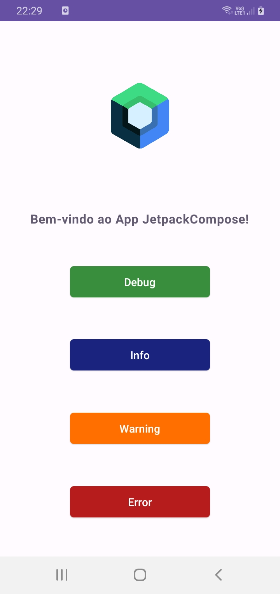

# introducaoLog-Kotlin
Interface realizada em Kotlin contendo botões que ao serem clicados, apresentam uma mensagem no Logcat. Os botões apresentam os seguintes Logs: Debug, Info, Warning e Error. Ademais, foi adicionada ao topo da tela o logotipo do JetpackCompose.
 

